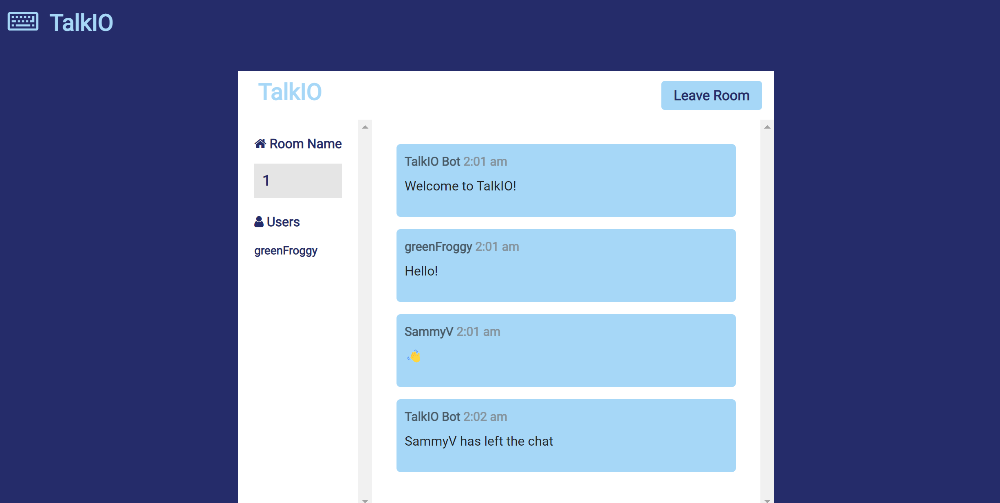

# Talk-IO, the real time chat app!
    NOTE: This project uses the MIT license!

## Description
Welcome to TalkIO! This project showcases the Model-View-Controller paradigm that composes an app for users that can create and login to their accounts and chat. The app only has a single server or "room" as we call it. The goal was to showcase the use of SocketIO's web sockets for real-time messaging. 
# Tech Used:
 HTML, CSS, JavaScript, Node.js, Express.js, MySQL2, Sequelize, BCrypt, .env, API, HandleBars, Socket.iO 
## Table of Contents
- [Installation](#installation)
- [Usage](#usage)
- [License](#license)
- [Contributing](#contributing)
- [Tests](#tests)
- [Questions](#questions)
## Installation
Installation Information is not available for this app. 
## Usage
To use this application, and test the routes, you will have to clone the repo down to your local machine and run it locally using "npm start"

## License
This project uses the following license: 
MIT
## Contributing
No contributions guidelines are established for this project yet. 
## Tests 
To test this project, create an account and chat! 

# Screenshots:

## When you first enter the website, you are presented with two options. In case you don't have an account, you can create a new one. If you already have one, you can log right in!

# This is a screenshot of the website in action:

## Questions
Here is some contact information to find me: 

[Github](https://www.github.com/Albertojl3)

Email: 363alberto@gmail.com
## Links
You can find the deployed side here!

[TalkIO](https://talkio.herokuapp.com/)